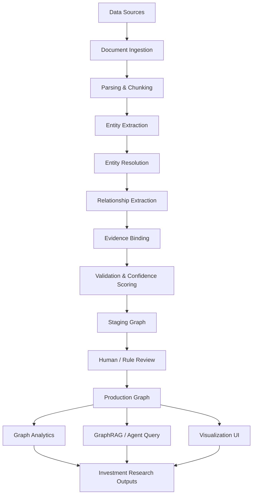
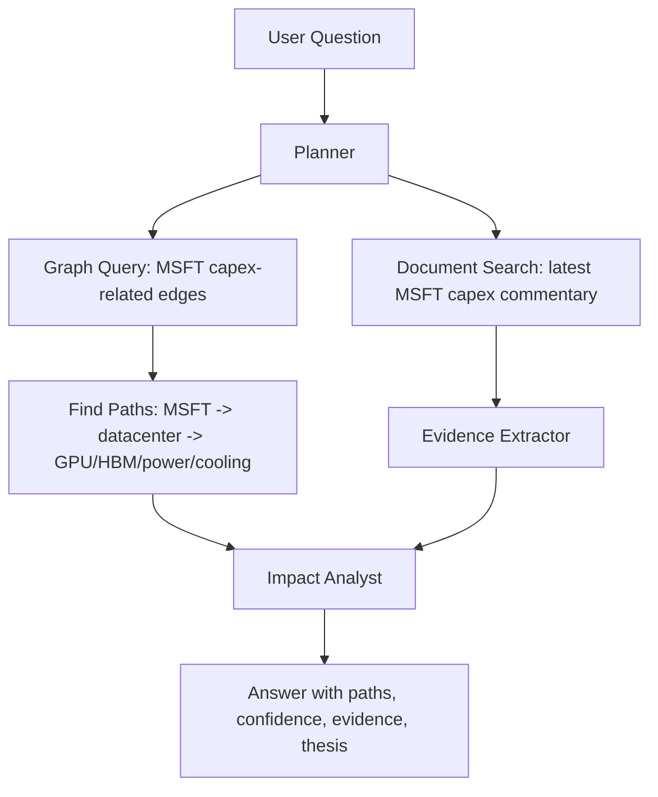

# 二级市场价值链研究工具产品设计文档

**项目代号**：Value Chain Research Graph / VCRG  
**文档版本**：v0.1  
**日期**：2026-06-29  
**目标读者**：产品评审、工程评审、投资研究评审、LLM agent 架构评审  
**定位**：面向二级市场投资研究的证据化产业价值链图谱工具

---

## 1. 一句话定义

本项目旨在构建一个 **面向美股上市公司的证据化产业价值链知识图谱**，用图结构表达公司、产品、技术、供应商、客户、竞争者、终端市场之间的关系，并结合财务指标、文本证据和 LLM agent，帮助投资者理解一条产业链中：

- 谁向谁付钱；
- 谁依赖谁；
- 谁和谁竞争；
- 谁承接行业增长；
- 谁拥有定价权；
- 利润最终沉淀在哪里；
- 哪些公司只是弱势环节，不值得投资。

本工具不承诺直接提供 alpha，但应至少成为一个 **产业链研究、排雷、投资假设生成和证据审计工具**。

---

## 2. 背景与问题

传统二级市场研究经常以单家公司为中心：财报、估值、管理层表述、业务分部、盈利预测。但很多真正重要的投资判断来自 **产业链位置**，而不是公司孤立财务表现。

例如：

- AI datacenter capex 增长时，利润会更多沉淀在 GPU、HBM、先进封装、交换芯片、光模块、电力设备、液冷、数据中心 REIT 中的哪一环？
- 某公司收入增长是来自真实需求、库存周期、单一客户拉货，还是行业短期缺货？
- 某个高增长赛道中，哪些公司处于强势瓶颈位置，哪些公司只是被上下游挤压的制造环节？
- 某个公司看似便宜，但是否因为其所在价值链位置天然低利润、低壁垒、低定价权？

现有研究流程的问题：

1. **关系信息分散**：10-K、10-Q、investor deck、earnings call、新闻稿、行业研报、供应链新闻、政府文件、海关数据、采购合同分散在不同位置。
2. **产业链关系不直观**：投资者读完几十篇资料后，仍难以形成结构化地图。
3. **证据难追溯**：人工研究笔记中常出现“据说 A 是 B 的供应商”，但缺少可追溯来源。
4. **关系变化难维护**：客户更换供应商、技术路线迁移、产能瓶颈变化后，旧研究很快失效。
5. **LLM 直接问答不稳定**：LLM 可以总结，但容易把事实、推理和观点混在一起，缺少可审计结构。

本项目试图把产业研究从“文本阅读 + 人脑记忆”升级为“证据化图谱 + 可控 agent + 可视化分析”。

---

## 3. 产品目标与价值

### 3.1 核心目标

构建一个可持续更新的产业价值链图谱，支持以下任务：

1. **产业链可视化**  
   以图结构展示公司、产品、技术、终端市场、供应商、客户、竞争者关系。

2. **价值流解释**  
   解释同一条链上谁为谁付钱、谁承担成本、谁获取利润、谁受益于需求增长。

3. **瓶颈识别**  
   识别供给受限、替代难、集中度高、扩产周期长、利润率高的关键节点。

4. **弱势公司排除**  
   排除处于低壁垒、低议价权、高客户集中度、高资本开支、低毛利、强竞争节点的公司。

5. **证据链管理**  
   每条关系边都必须绑定来源、原文片段、时间、置信度和更新记录。

6. **LLM 研究助理**  
   让 LLM 基于图谱进行查询、解释、更新提案、异常检测和研究报告生成，而不是让 LLM 无约束地产生结论。

### 3.2 非目标

本项目第一阶段不追求：

- 自动交易；
- 直接股票推荐；
- 全市场全行业覆盖；
- 预测短期股价；
- 取代人工研究员；
- 直接复制 Bloomberg / FactSet / S&P 的商业数据库。

### 3.3 最小可接受价值

即使无法稳定产生 alpha，工具也应提供以下价值：

- 让投资者快速理解一个行业的上下游结构；
- 避免把弱势环节误认为核心受益公司；
- 帮助发现“公司 A 的增长其实依赖公司 B 的 capex / 订单 / 技术路线”；
- 把投资假设拆解成可验证的图谱关系；
- 在新信息出现时，快速判断它影响产业链哪几个节点。

---

## 4. 竞品与市场验证

该方向不是伪需求。成熟金融数据商已经提供类似能力，说明机构用户确实需要结构化公司关系数据。

### 4.1 商业产品参考

| 产品 / 数据集 | 相关能力 | 对本项目的启发 |
|---|---|---|
| FactSet Supply Chain Relationships | 覆盖客户、供应商、竞争者、战略伙伴等关系；数据来自年报、投资者展示、新闻稿等公开来源。 | 证明“公司关系图谱”是投资数据产品的成熟品类。 |
| Bloomberg Supply Chain | 可视化 100,000+ 家公私公司、500,000+ 条供应商/客户关系，历史数据回溯至 2006 年。 | 证明“供应链图谱 + 风险/关系分析”有机构级需求。 |
| S&P Global Company Relationships | 覆盖 S&P Capital IQ 公司宇宙中的多类公司关系，API / feed / desktop 交付。 | 说明公司关系可以作为标准化金融数据集出售。 |
| S&P Global Business Relationships Analytics | 覆盖 600,000+ 实体和 1.6M customer-supplier relationships，并结合 AI/NLP 发现已知和估计关系。 | 启发本项目区分 confirmed relationship 与 estimated relationship。 |
| LSEG Workspace Value Chains / VCHAINS | 可通过 Workspace 命令查找公司客户与供应商。 | 说明桌面终端中的价值链图谱是已有工作流。 |
| AlphaSense / Tegus / Similar Research Platforms | 更偏文档检索、earnings call、专家访谈、AI research。 | 可作为文档层和深度研究层参考，但不是图数据库产品。 |

### 4.2 与商业产品的差异化

本项目不应试图在数据覆盖上直接追赶商业数据库。可行差异化是：

1. **面向个人投资者 / 小型研究团队**：降低成本，重点覆盖少数高价值行业。
2. **证据化与透明性**：每条边可追溯来源，支持人工审计。
3. **行业 schema 可定制**：AI datacenter、电池、光模块、半导体设备等行业可有不同节点和边类型。
4. **LLM-native workflow**：不是静态数据库，而是 agent 持续收集、提案、验证、更新。
5. **投资解释优先**：不仅说“谁是供应商”，还要解释“谁赚钱、谁受压、谁是瓶颈”。

---

## 5. 核心产品原则

### 5.1 图谱不是事实本身，证据才是事实来源

图上的每条边都必须绑定：

- source document；
- source URL / filing accession / page / section；
- excerpt；
- extraction method；
- confidence；
- created_at / updated_at；
- reviewer status。

没有证据的关系不能进入 production graph，只能进入 hypothesis layer。

### 5.2 区分事实、估计、推理和投资观点

必须明确区分四类边：

| 层级 | 含义 | 示例 | 是否可自动进入主图 |
|---|---|---|---|
| Fact edge | 文件或权威来源直接支持的事实 | Company A disclosed Customer B as 12% revenue customer | 可以，但需要证据和置信度 |
| Estimated edge | 多源推断出的估计关系 | Customer A likely accounts for 10–20% of Supplier B revenue | 进入 estimated layer |
| Inference edge | 基于产业逻辑的影响推理 | MSFT capex increase may benefit VRT | 进入 inference layer |
| Thesis edge | 投资研究观点 | Power bottleneck shifts profit pool to electrical equipment suppliers | 只能作为 analyst thesis |

### 5.3 LLM 不直接修改主图

LLM agent 只生成变更提案，进入 staging graph。变更必须经过：

1. schema 校验；
2. entity resolution；
3. source verification；
4. confidence scoring；
5. duplicate detection；
6. optional human review；
7. merge commit。

### 5.4 先做深，再做广

第一阶段不做全美股。建议从一个高价值行业开始，例如：

- AI datacenter value chain；
- semiconductor equipment / materials；
- optical networking / CPO；
- battery / energy storage；
- GLP-1 pharmaceutical supply chain；
- uranium / nuclear / grid infrastructure。

推荐 MVP 从 **AI datacenter capex value chain** 开始，因为公开信息多、公司多为美股上市、产业链传导明显、用户研究兴趣强。

---

## 6. 用户画像与使用场景

### 6.1 目标用户

| 用户类型 | 需求 | 使用方式 |
|---|---|---|
| 个人投资者 | 快速理解行业链条，避免买错环节 | 交互式图谱 + LLM 问答 |
| 专业买方研究员 | 验证产业链暴露、客户集中度、订单传导 | 图谱查询 + 证据追溯 |
| 行业研究员 | 维护某行业结构图 | schema 管理 + 图谱编辑 |
| 量化/数据研究员 | 获取关系数据，用于因子或事件研究 | API / graph export |
| 主题投资者 | 追踪 AI、电力、半导体、能源等主题扩散 | 主题图谱 + 事件传播路径 |

### 6.2 典型用户故事

1. **作为投资者**，我想查看 NVDA 的上游供应商和下游客户，以判断 AI GPU 需求增长会向哪些公司扩散。
2. **作为研究员**，我想知道 AI datacenter 价值链中哪些节点毛利率最高、集中度最高、扩产最慢。
3. **作为投资者**，我想排除某条产业链里低毛利、客户集中度高、竞争激烈的公司。
4. **作为研究员**，当 MSFT 发布 capex 指引上修时，我想知道哪些上游节点可能受益。
5. **作为用户**，我想点击任意边，看到这条关系的原始证据、来源日期和置信度。
6. **作为用户**，我想问：“如果 HBM 供给紧张，哪些美股公司最可能受益或受损？”

---

## 7. 核心概念模型

### 7.1 节点类型

不要只把公司作为节点。公司之间的关系通常经过产品、技术和终端市场中介。

| 节点类型 | 示例 | 说明 |
|---|---|---|
| Company | NVDA, TSMC, AVGO, MU, VRT | 上市或非上市公司 |
| Security | NVDA US Equity | 可交易证券，与 Company 分离 |
| Segment | Data Center, Gaming, Foundry | 公司业务分部 |
| Product | H100, HBM3E, CoWoS, Ethernet switch | 产品或组件 |
| Technology | EUV, advanced packaging, liquid cooling | 技术路线 |
| EndMarket | AI datacenter, EV, smartphone | 终端需求场景 |
| Facility | Fab, packaging plant, data center campus | 产能或地理实体 |
| Commodity | copper, lithium, helium, neon gas | 大宗商品/关键原材料 |
| Event | earnings call, capacity expansion, supply agreement | 事件节点 |
| Document | 10-K, 10-Q, investor presentation, transcript | 证据来源 |
| AnalystThesis | bottleneck thesis, margin thesis | 研究观点节点 |

### 7.2 边类型

| 边类型 | 方向 | 含义 |
|---|---|---|
| SUPPLIES_TO | supplier → customer | 供应关系 |
| BUYS_FROM | customer → supplier | 采购关系；与 SUPPLIES_TO 反向，可冗余存储或查询生成 |
| COMPETES_WITH | company ↔ company | 横向竞争关系 |
| SUBSTITUTES_FOR | product/company → product/company | 替代关系 |
| DEPENDS_ON | company/product → input/product/technology | 依赖关系 |
| USES_TECHNOLOGY | product/company → technology | 技术路线关系 |
| SERVES_MARKET | company/product → end market | 终端市场暴露 |
| HAS_SEGMENT | company → segment | 公司业务分部 |
| PRODUCES | company/segment → product | 生产关系 |
| HAS_CAPACITY_IN | company/product → facility/geography | 产能关系 |
| REPORTED_IN | fact/edge → document | 证据关系 |
| IMPACTS | event → company/product/market | 事件影响 |
| HAS_THESIS | analyst → thesis / thesis → edge | 投资观点关系 |

### 7.3 边属性

每条业务关系边至少包含：

```yaml
edge_id: string
relationship_type: enum
source_node_id: string
target_node_id: string
valid_from: date | null
valid_to: date | null
economic_direction: enum   # who_pays_whom / who_supplies_whom / symmetric
revenue_exposure_pct: float | range | null
cost_exposure_pct: float | range | null
capex_exposure_pct: float | range | null
volume_exposure: string | null
confidence_score: float    # 0.0 - 1.0
confidence_label: enum     # high / medium / low
status: enum               # candidate / reviewed / confirmed / deprecated / rejected
layer: enum                # fact / estimate / inference / thesis
source_count: int
last_verified_at: datetime
created_by: enum           # llm_agent / human / import_script
reviewed_by: string | null
notes: string
```

### 7.4 证据模型

证据不应只是 URL，而应作为独立对象管理。

```yaml
Evidence:
  evidence_id: string
  document_id: string
  source_type: enum   # SEC filing / transcript / presentation / press release / news / research report
  title: string
  publisher: string
  published_at: datetime
  retrieved_at: datetime
  url: string | null
  accession_number: string | null
  page: int | null
  section: string | null
  excerpt: string
  excerpt_hash: string
  extraction_method: enum  # rule / llm / human / imported
  reliability_score: float
```

### 7.5 图层设计

建议 production graph 分层：

```text
Layer 0: Identity Layer
  - 公司、ticker、CIK、CUSIP、ISIN、LEI、别名、并购历史

Layer 1: Fact Graph
  - 有直接证据支持的公司、产品、客户、供应商、市场关系

Layer 2: Estimate Graph
  - 多源估计或模型推断的比例、权重、暴露关系

Layer 3: Inference Graph
  - 事件影响路径、供需传导、利润池迁移

Layer 4: Analyst Thesis Layer
  - 人工或 agent 生成的研究观点、投资假设、待验证问题
```

---

## 8. 系统架构

### 8.1 总体架构



### 8.2 模块划分

| 模块 | 功能 |
|---|---|
| Source Manager | 管理 SEC、新闻、transcript、presentation、研报等来源 |
| Document Parser | PDF/HTML/XBRL/transcript 转结构化 Markdown/JSON |
| Entity Resolver | 公司、ticker、产品、别名、业务分部消歧 |
| Relation Extractor | 从文本抽取候选关系 |
| Evidence Store | 保存原始文档、chunk、引用片段、hash |
| Graph Store | 存储 property graph |
| Vector Store | 存储文档 embedding，供 RAG 使用 |
| Staging Graph | 保存未确认候选关系 |
| Review Console | 人工确认、修改、拒绝、合并关系 |
| Graph Analytics Engine | 中心性、瓶颈、利润池、传导路径分析 |
| Agent Orchestrator | 管理 LLM agent 任务流 |
| UI / API | 图谱浏览、问答、报告、导出 |

### 8.3 数据流

#### 8.3.1 初始建图

```text
指定行业主题
  → 建立行业 seed list
  → 收集核心公司 10-K / 10-Q / investor deck / transcripts
  → 抽取 segment、products、customers、suppliers、competitors
  → entity resolution
  → 创建 candidate graph
  → 运行验证规则
  → 人工 review
  → 形成 v0 production graph
```

#### 8.3.2 增量更新

```text
每日/每周监控新文件和新闻
  → 判断是否涉及已有节点或新节点
  → 抽取新增关系或关系变更
  → 生成 graph diff
  → 对高影响变更发出 review alert
  → merge / reject / deprecate old edge
```

#### 8.3.3 用户问答

```text
用户问题
  → 意图识别
  → 图查询 / 文档检索 / 混合检索
  → 返回路径、证据、解释
  → 标记事实/估计/推理/观点
```

---

## 9. LLM Agent 设计

### 9.1 Agent 角色

| Agent | 职责 | 是否可写图 |
|---|---|---|
| Planner Agent | 将研究问题拆解为搜索和抽取任务 | 否 |
| Source Discovery Agent | 查找相关 filings、presentation、transcripts、news | 否 |
| Document Parsing Agent | 判断文档结构，定位相关 section/table | 否 |
| Entity Extraction Agent | 提取公司、产品、技术、市场、设施等实体 | 只能写 candidate |
| Entity Resolution Agent | 处理别名、ticker、CIK、并购更名 | 只能写 candidate |
| Relationship Extraction Agent | 提取供应、客户、竞争、替代、依赖关系 | 只能写 candidate |
| Evidence Verification Agent | 检查边是否被证据支持 | 只能写 validation result |
| Graph Diff Agent | 生成新增、修改、废弃关系提案 | 只能写 staging |
| Analyst Agent | 基于图谱生成解释、投资假设、排雷观点 | 不写事实层 |
| QA Agent | 回答用户问题，引用图路径和证据 | 不写图 |

### 9.2 Agent 工作流示例

问题：`MSFT capex 上修会通过哪些路径影响美股上市公司？`



### 9.3 关键约束

LLM 输出必须结构化：

```json
{
  "candidate_edges": [
    {
      "source": "Microsoft",
      "target": "NVIDIA",
      "relationship_type": "BUYS_FROM",
      "layer": "inference",
      "evidence_ids": ["ev_123"],
      "confidence_score": 0.62,
      "reasoning": "Microsoft disclosed AI infrastructure capex growth; NVIDIA is a major GPU supplier to hyperscalers, but direct revenue share is not disclosed in this document."
    }
  ]
}
```

禁止：

- 无 evidence_id 的 fact edge；
- 把推理写成事实；
- 把“likely / may / could”改写为确定关系；
- 自动覆盖人工确认过的边；
- 不保留旧关系版本。

---

## 10. 图谱分析能力

### 10.1 基础查询

- 查看公司上下游；
- 查看公司客户集中度；
- 查看公司供应商集中度；
- 查看某产品链条；
- 查看某终端市场受益公司；
- 查看某公司竞争对手；
- 查看某事件影响路径。

### 10.2 投资研究指标

#### 10.2.1 Value Chain Strength Score

用于粗筛公司在产业链中的强弱位置。

可由以下因素组成：

| 因子 | 方向 |
|---|---|
| 毛利率 / 营业利润率 | 越高越好 |
| ROIC | 越高越好 |
| 收入增长 | 越高越好，但需结合周期 |
| 客户集中度 | 过高扣分 |
| 供应商集中度 | 过高扣分 |
| 替代品数量 | 越多越差 |
| 竞争者数量 | 越多越差 |
| 切换成本 | 越高越好 |
| 产能扩张周期 | 越长且需求强时越可能形成瓶颈 |
| 资本开支强度 | 视行业而定；高 capex 但无定价权扣分 |
| 图中心性 | 高中心性但需区分强依赖和弱势被依赖 |

#### 10.2.2 Bottleneck Score

衡量某节点是否是行业瓶颈。

候选特征：

- 入边需求增长快；
- 出边供应选择少；
- 产能扩张周期长；
- 技术壁垒高；
- 市占率集中；
- 毛利率高且稳定；
- 客户愿意预付款或签长期协议；
- 下游明确提到 supply constraint；
- 替代产品短期不可用。

#### 10.2.3 Profit Pool Score

衡量利润沉淀位置。

候选特征：

- 该节点公司平均毛利率；
- 该节点公司营业利润率；
- free cash flow margin；
- ROIC；
- revenue per employee；
- unit economics；
- industry concentration；
- pricing power statements in transcripts；
- historical margin expansion during demand upcycle。

#### 10.2.4 Weak Link / Avoidance Score

用于排除弱势公司。

高风险特征：

- 低毛利率；
- 高客户集中度；
- 高供应商集中度；
- 产品同质化；
- 上下游都强势；
- 强周期且库存波动大；
- 资本开支重但回报低；
- 价格接受者；
- 缺少明确技术壁垒；
- 替代品多；
- 主要收入来自单一大客户或单一产品。

### 10.3 路径分析

示例查询：

```cypher
MATCH path = (m:Company {ticker:'MSFT'})-[:BUYS_FROM|DEPENDS_ON|SERVES_MARKET*1..4]-(c:Company)
WHERE c.exchange IN ['NASDAQ','NYSE']
RETURN path
```

示例投资解释：

```text
MSFT capex increase
  → AI datacenter buildout
  → GPU demand
  → HBM demand
  → advanced packaging demand
  → power and cooling demand
```

每条路径应返回：

- path nodes；
- path edges；
- confidence；
- evidence；
- exposed public companies；
- possible beneficiaries；
- possible losers；
- open questions。

---

## 11. 数据源设计

### 11.1 第一阶段公开数据源

| 数据源 | 用途 | 优点 | 缺点 |
|---|---|---|---|
| SEC EDGAR 10-K / 10-Q / 8-K | segment、客户集中度、风险因素、合同、业务描述 | 权威、免费、结构稳定 | 供应链信息不完整；客户身份常不披露 |
| SEC XBRL Company Facts | 财务指标、segment 部分数据 | 官方 API，结构化 | 业务关系信息有限 |
| Investor presentations | 产品、客户行业、TAM、产业链图 | 信息密度高 | 口径营销化，格式杂乱 |
| Earnings call transcripts | 管理层对需求、供给、客户、瓶颈的评论 | 对投资最有用 | 数据源可能收费，文本噪声高 |
| Press releases | 订单、合作、供应协议 | 事件及时 | 选择性披露，宣传倾向强 |
| Company websites | 产品和客户案例 | 对产品层节点有用 | 不标准，更新不可控 |
| News | 新订单、客户切换、供应链事件 | 时效高 | 噪声高，需要来源质量评分 |
| Public industry reports | 行业结构、技术路线 | 适合初始建图 | 版权和复用限制 |
| Wikipedia / Wikidata | 基础实体、并购、别名 | 免费，方便冷启动 | 金融研究深度不足 |

### 11.2 SEC 数据特殊限制

ASC 280 要求上市公司披露来自单一外部客户且占总收入 10% 或以上的收入金额及相关 segment，但并不总是要求披露客户名称。因此工具必须支持以下情况：

```text
Customer A accounted for 23% of revenue
```

在图谱中可表示为匿名客户节点：

```text
AnonymousMajorCustomer_CompanyX_FY2025
```

并在后续文档、新闻或行业资料中尝试解析真实身份。不能因为 LLM “猜测” Customer A 是 Apple，就直接写入 fact graph。

### 11.3 商业数据源接入策略

如果未来有预算，可接入：

- FactSet Revere Supply Chain Relationships；
- Bloomberg SPLC；
- S&P Global Business Relationships Analytics；
- LSEG Workspace / DataScope；
- AlphaSense / Tegus / Visible Alpha / Canalys / Gartner / IDC 等研究源。

但 MVP 应先建立 **开源/公开数据 pipeline**，避免早期依赖昂贵商业数据。

---

## 12. 可参考项目、论文与资料

### 12.1 商业数据产品

| 名称 | 类型 | 参考价值 |
|---|---|---|
| FactSet Supply Chain Relationships | 商业数据集 | 公司客户、供应商、竞争者、合作伙伴关系图谱产品标杆 |
| Bloomberg Supply Chain | 商业终端/数据 | 大规模供应商/客户网络、历史关系、可视化 |
| S&P Global Company Relationships | 商业数据集 | 多类别公司关系 schema |
| S&P Global Business Relationships Analytics | 商业数据集 | AI/NLP 发现已知和估计 customer-supplier links |
| LSEG Workspace Value Chains | 商业终端功能 | 终端内供应商/客户价值链查询工作流 |

### 12.2 金融知识图谱与供应链知识图谱论文

| 名称 | 年份 | 重点 | 对本项目启发 |
|---|---:|---|---|
| FinReflectKG: Agentic Construction and Evaluation of Financial Knowledge Graphs | 2025 | 从 S&P 100 最新 10-K 构建开源金融 KG；使用文档解析、table-aware chunking、schema-guided extraction、reflection feedback loop | 直接参考 extraction + evaluation pipeline |
| FinReflectKG-EvalBench | 2025/2026 | 金融 KG 抽取评估；faithfulness、precision、relevance、comprehensiveness | 可参考为图谱质量评估体系 |
| FinReflectKG-MultiHop | 2025 | 基于 KG 的多跳金融 QA，减少 token 使用并提高正确性 | 支持 GraphRAG 比普通 RAG 更适合金融多跳问题 |
| FinDKG: Financial Dynamic Knowledge Graph | 2024 | 从金融新闻流构建动态知识图谱，用于趋势和主题投资分析 | 参考 temporal graph 与新闻增量更新 |
| Helicase: Uncertainty-Guided Supply Chain Knowledge Graph Construction with Autonomous Multi-Agent LLMs | 2026 | 多 agent、供应链 KG、三层不确定性管理、动态建图 | 非常接近本项目 agent 方向 |
| Enhancing Supply Chain Visibility with Knowledge Graphs and LLMs | 2024/2025 | 用 KG + LLM 提升供应链可见性 | 参考 supply chain visibility 的建模思路 |
| Enhancing Supply Chain Visibility with Generative AI: Relationship Prediction in KGs | 2024 | 用 GenAI embedding + ML 预测供应链关系 | 参考 link prediction，用于 estimated layer |
| Discovering Supply Chain Links with Augmented Intelligence | 2021 | 使用 GNN + 专家知识发现未知供应商/客户 | 说明供应链 link prediction 是已存在研究方向 |
| KAG: Boosting LLMs in Professional Domains via Knowledge Augmented Generation | 2024 | 专业领域 KG + LLM 逻辑推理框架 | 参考 schema-constrained reasoning 与 graph-grounded QA |
| Multi-Agent GraphRAG: Text-to-Cypher Framework for Labeled Property Graphs | 2025 | 多 agent 生成 Cypher 查询，使用 property graph | 参考自然语言到图查询接口 |

### 12.3 开源项目与框架

| 项目 | 类型 | 用途 |
|---|---|---|
| OpenSPG / KAG | 知识图谱引擎 + KAG 框架 | 适合严肃领域知识建模、逻辑推理、schema 约束 |
| Neo4j + neo4j-graphrag-python | 图数据库 + GraphRAG | 成熟、文档完善、生态强，适合 MVP |
| Memgraph | 高性能内存图数据库 | 适合实时图分析、Cypher、GraphRAG、MAGE 算法 |
| Kuzu | 嵌入式 property graph DB | 适合本地/个人版、轻量部署、分析型图查询 |
| NetworkX / igraph | 图算法库 | 原型阶段计算中心性、路径、社区、bottleneck score |
| LlamaIndex PropertyGraphIndex | LLM 构建和查询 property graph | 快速原型验证 GraphRAG 流程 |
| LangGraph | Agent workflow 编排 | 适合 planner/extractor/verifier/reviewer 多 agent 工作流 |
| Docling | 文档解析 | PDF、表格、版面结构解析，适合 filings / presentations |
| Unstructured | 文档 ETL | PDF、HTML、Word、PPT 等转结构化文本 |
| Qdrant / pgvector / LanceDB | 向量数据库 | 文档 chunk 检索与 GraphRAG hybrid retrieval |
| FastAPI | 后端 API | Graph 查询、agent task、UI 数据服务 |
| React + Cytoscape.js / Sigma.js / Graphistry | 图可视化 | 前端交互式图谱 |
| Prefect / Dagster / Airflow | 数据 pipeline 编排 | 定时抓取、解析、抽取、更新 |

---

## 13. 推荐技术选型

### 13.1 MVP 推荐栈

| 层 | 推荐选择 | 原因 |
|---|---|---|
| 编程语言 | Python | LLM、数据处理、金融 API、图算法生态最好 |
| API 服务 | FastAPI | 简洁、异步友好、易与 Python 数据栈集成 |
| 图数据库 | Neo4j Community 或 Memgraph | Cypher 生态成熟，方便可视化和 GraphRAG |
| 本地轻量图 DB | Kuzu | 适合个人版、离线版、嵌入式部署 |
| 文档解析 | Docling + Unstructured | 覆盖 PDF/HTML/PPT/表格 |
| 向量库 | pgvector 或 Qdrant | 文档检索和证据召回 |
| 关系抽取 | Pydantic schema + LLM structured output | 强约束输出，方便校验 |
| Agent 编排 | LangGraph | 多步骤、多 agent、状态机、可恢复工作流 |
| 图算法 | NetworkX / igraph，后续迁移到 Memgraph MAGE | 快速实现 centrality、path、community |
| 数据库 | PostgreSQL | 存储文档 metadata、任务、用户、review 状态 |
| 对象存储 | Local FS / S3-compatible MinIO | 存储 PDF、HTML、Markdown、JSON |
| 前端 | React + Cytoscape.js | 交互式图谱可视化成熟 |
| 部署 | Docker Compose | MVP 易部署；后续 Kubernetes |

### 13.2 推荐架构组合

#### 方案 A：个人研究者 MVP

```text
FastAPI
PostgreSQL + pgvector
Kuzu or Neo4j Community
Docling / Unstructured
LangGraph
React + Cytoscape.js
Local filesystem / MinIO
```

优点：成本低、部署简单、适合快速验证。

#### 方案 B：团队协作版

```text
FastAPI
PostgreSQL
Neo4j Enterprise / Memgraph
Qdrant
S3 / MinIO
Prefect / Dagster
LangGraph
React + Cytoscape.js / Graphistry
```

优点：更适合多人 review、任务调度、权限管理和更大图谱。

#### 方案 C：严肃 KG / 逻辑推理版

```text
OpenSPG + KAG
PostgreSQL
Docling
LLM structured extraction
Custom review console
```

优点：schema 约束和专业领域推理更强；缺点是工程学习成本较高。

### 13.3 当前建议

第一版建议采用：

```text
Neo4j Community + PostgreSQL/pgvector + FastAPI + LangGraph + Docling + React/Cytoscape.js
```

理由：

- 容易让 Claude Code / Codex 快速生成可运行原型；
- Neo4j/Cypher 便于调试图关系；
- pgvector 可先承担向量检索，不必引入太多组件；
- LangGraph 适合把 LLM agent 限制成可控状态机；
- Docling 对 PDF、表格和 investor deck 的解析能力适合本项目。

---

## 14. MVP 设计

### 14.1 MVP 行业选择

推荐：**AI Datacenter Value Chain**。

理由：

- 用户关注度高；
- 美股上市公司多；
- 产业链关系明确；
- 财报和 call 中有大量 capex、supply constraint、customer demand 信息；
- 上下游传导明显；
- 容易展示工具价值。

### 14.2 MVP 覆盖范围

#### 初始节点

| 类别 | 示例 |
|---|---|
| Hyperscaler | MSFT, AMZN, GOOGL, META, ORCL |
| GPU / Accelerator | NVDA, AMD, AVGO, MRVL |
| Foundry | TSM, INTC, Samsung |
| HBM / Memory | MU, Samsung, SK Hynix |
| Advanced Packaging | TSMC CoWoS, ASE, AMKR |
| Networking | AVGO, ANET, MRVL, CSCO, CIEN |
| Optical Module | COHR, LITE, AAOI, Fabrinet |
| Power / Cooling | VRT, ETN, PWR, CEG, NRG |
| Data Center / REIT | EQIX, DLR |
| Semiconductor Equipment | ASML, AMAT, LRCX, KLAC, TER |

#### 初始问题

1. `NVDA 的 AI GPU 价值链上游和下游是谁？`
2. `AI datacenter capex 增长最可能沉淀到哪些环节？`
3. `HBM 瓶颈会影响哪些公司？`
4. `哪些公司是 AI datacenter 链条中的弱势制造环节？`
5. `某个公司上涨是否已经脱离其产业链强度？`

### 14.3 MVP 功能列表

#### P0 功能

- 公司/产品/市场节点入库；
- 手动 seed list；
- SEC 10-K/10-Q 下载；
- 文档解析为 Markdown/chunks；
- LLM 抽取候选实体和关系；
- evidence 绑定；
- Neo4j 图存储；
- 图谱可视化；
- 边点击查看证据；
- staging graph review；
- 基础图查询；
- LLM 基于图回答问题。

#### P1 功能

- earnings call transcript 接入；
- investor presentation 接入；
- 每日/每周增量监控；
- confidence scoring；
- graph diff；
- bottleneck score；
- weak link score；
- graph-based report generation。

#### P2 功能

- link prediction；
- 自动行业扩展；
- 多行业 schema；
- 事件传播模拟；
- 财务预测集成；
- 用户自定义 thesis layer；
- API export；
- Backtest integration。

---

## 15. 数据质量与评估体系

### 15.1 关系抽取质量指标

| 指标 | 定义 |
|---|---|
| Faithfulness | 抽取关系是否被原文支持 |
| Precision | 抽取关系是否准确 |
| Recall / Comprehensiveness | 是否漏掉关键关系 |
| Relevance | 关系是否对投资研究有价值 |
| Entity Resolution Accuracy | 公司/产品/别名是否正确对齐 |
| Evidence Coverage | 每条边是否有足够证据 |
| Temporal Correctness | 关系是否仍然有效 |
| Layer Correctness | 是否正确区分 fact / estimate / inference / thesis |

### 15.2 边置信度评分

建议初版规则：

```text
confidence_score =
  source_reliability * 0.35
+ evidence_directness * 0.30
+ source_recency * 0.10
+ multi_source_confirmation * 0.15
+ extraction_consistency * 0.10
```

#### source_reliability 示例

| 来源 | 可靠性 |
|---|---:|
| SEC filing | 0.95 |
| Company investor presentation | 0.80 |
| Earnings call transcript | 0.75 |
| Press release | 0.70 |
| Reputable financial news | 0.65 |
| Blog / forum / social media | 0.30 |
| LLM inference only | 0.00 for fact edge |

### 15.3 Review 状态

```text
candidate → reviewed → confirmed
candidate → rejected
confirmed → deprecated
confirmed → superseded
estimated → upgraded_to_fact
inference → converted_to_thesis
```

---

## 16. UI 设计草案

### 16.1 主界面

| 区域 | 功能 |
|---|---|
| 左侧搜索栏 | 搜公司、ticker、产品、技术、市场 |
| 中央图谱 | 可缩放、过滤、展开上下游 |
| 右侧详情面板 | 节点/边属性、证据、财务指标、LLM解释 |
| 顶部过滤器 | 行业、关系类型、置信度、时间、图层 |
| 底部 timeline | 查看关系变化历史 |

### 16.2 边详情面板

点击一条边后展示：

```text
Relationship: MU SUPPLIES_TO AI Datacenter HBM Demand
Layer: Fact / Estimate / Inference
Confidence: 0.78 Medium-High
Economic direction: Customer pays supplier
Exposure: not disclosed
Sources:
  1. MU FY2025 10-K, page xx, excerpt...
  2. Earnings call 2026-Q2, excerpt...
Agent notes:
  - Direct customer identity not disclosed.
  - Relationship inferred at product/market level, not direct named supplier relationship.
Review status: pending / confirmed
```

### 16.3 图谱视图

建议提供多种 view：

1. Company view：以公司为中心的上下游。
2. Product chain view：以产品/组件为中心的价值链。
3. End market view：以终端市场为中心的受益路径。
4. Bottleneck view：高亮瓶颈节点。
5. Profit pool view：按利润率、ROIC、FCF margin 着色。
6. Weak link view：高亮低议价权公司。
7. Event impact view：某新闻/财报事件影响路径。

---

## 17. API 草案

### 17.1 Graph 查询

```http
GET /api/graph/company/{ticker}/upstream?depth=2
GET /api/graph/company/{ticker}/downstream?depth=2
GET /api/graph/product/{product_id}/chain
GET /api/graph/market/{market_id}/beneficiaries
GET /api/graph/path?source=MSFT&target=VRT&max_depth=4
```

### 17.2 Evidence 查询

```http
GET /api/evidence/{edge_id}
GET /api/documents/{document_id}/chunks/{chunk_id}
```

### 17.3 Agent 任务

```http
POST /api/agent/research
POST /api/agent/extract_relationships
POST /api/agent/verify_edge
POST /api/agent/generate_report
```

### 17.4 Review

```http
GET /api/review/candidates
POST /api/review/edge/{edge_id}/confirm
POST /api/review/edge/{edge_id}/reject
POST /api/review/edge/{edge_id}/edit
```

---

## 18. 数据库设计简表

### 18.1 PostgreSQL 表

| 表 | 内容 |
|---|---|
| companies | company master data |
| securities | ticker / exchange / identifiers |
| documents | source docs metadata |
| chunks | parsed text chunks |
| evidence | edge-level evidence |
| extraction_jobs | agent jobs |
| review_items | candidate edge review queue |
| graph_versions | graph snapshots / commits |
| users | users and permissions |

### 18.2 Neo4j Label

```cypher
(:Company)
(:Security)
(:Segment)
(:Product)
(:Technology)
(:EndMarket)
(:Commodity)
(:Facility)
(:Document)
(:Evidence)
(:Event)
(:AnalystThesis)
```

### 18.3 Neo4j Relationship Types

```cypher
[:SUPPLIES_TO]
[:BUYS_FROM]
[:COMPETES_WITH]
[:SUBSTITUTES_FOR]
[:DEPENDS_ON]
[:USES_TECHNOLOGY]
[:SERVES_MARKET]
[:HAS_SEGMENT]
[:PRODUCES]
[:HAS_CAPACITY_IN]
[:REPORTED_IN]
[:IMPACTS]
[:HAS_THESIS]
```

---

## 19. 工程路线图

### Phase 0：技术验证，1–2 周

目标：证明从 SEC filing / investor deck 中抽取关系并入图可行。

交付：

- 拉取 5–10 家公司 filings；
- Docling/Unstructured 解析；
- LLM structured extraction；
- Neo4j 入库；
- 简单 Cytoscape.js 图展示；
- 点击边展示 evidence。

### Phase 1：AI Datacenter MVP，3–6 周

目标：形成可用的 AI datacenter 价值链图谱。

交付：

- 50–100 个公司/产品/市场节点；
- 200–500 条候选关系；
- review console；
- upstream/downstream 查询；
- LLM graph Q&A；
- 基础 bottleneck / weak link score。

### Phase 2：增量更新与研究报告，6–10 周

目标：让图谱能随新信息更新，并生成投资研究输出。

交付：

- 每周 filings/news 监控；
- graph diff；
- 更新提醒；
- event impact path；
- 自动生成行业周报；
- thesis layer。

### Phase 3：多行业扩展，10 周+

目标：扩展到半导体设备、电力设备、光模块、电池等行业。

交付：

- 多行业 schema；
- 跨行业主题图谱；
- link prediction；
- 用户自定义行业图；
- API export。

---

## 20. 风险与应对

| 风险 | 影响 | 应对 |
|---|---|---|
| LLM 幻觉关系 | 图谱污染 | evidence mandatory；staging graph；human review |
| 公开数据不完整 | 覆盖不足 | 区分 anonymous / estimated；允许 hypothesis layer |
| Entity resolution 错误 | 公司/产品混淆 | CIK/ticker/alias master；人工复核关键节点 |
| 图谱变成漂亮玩具 | 没有投资价值 | 强制接入利润率、ROIC、客户集中度、bottleneck score |
| 版权问题 | 不能存储或分发研报全文 | 只存 metadata 和用户自有摘要；尊重许可；优先公开来源 |
| 维护成本高 | 项目失控 | 先单行业深做，控制 schema |
| 置信度伪精确 | 用户误信模型分数 | 显示 confidence label + 原因，不只显示数字 |
| 商业数据不可得 | 覆盖落后 | MVP 聚焦公开数据和手动 review |
| Agent 任务过复杂 | 运行不稳定 | 用 LangGraph 状态机，拆成小任务 |

---

## 21. 关键设计决策

### 决策 1：采用 property graph，而不是纯 RDF triple

原因：

- 边需要大量属性：置信度、时间、证据、暴露比例、review 状态；
- Cypher 查询对工程实现友好；
- Neo4j/Memgraph/Kuzu 生态成熟；
- 前端可视化更直接。

### 决策 2：production graph 与 staging graph 分离

原因：

- LLM 抽取结果必须隔离；
- 支持 review、diff、rollback；
- 避免主图被污染。

### 决策 3：从行业主题图开始，而不是全市场

原因：

- 不同行业 schema 差异大；
- 全市场覆盖会稀释质量；
- 投资价值来自深度，不是节点数量。

### 决策 4：优先做证据和关系质量，而不是自动化广度

原因：

- 投资研究场景中错误边的成本高；
- 用户信任来自可追溯证据；
- 高质量小图比低质量大图更有用。

---

## 22. Claude 评审问题清单

建议让 Claude 重点评审以下问题：

1. 当前 schema 是否过复杂？MVP 是否需要进一步收缩？
2. Fact / Estimate / Inference / Thesis 四层是否足够清晰？
3. Edge schema 是否遗漏关键投资属性？
4. 是否应该先用 Neo4j，还是直接用 Kuzu 做本地轻量版？
5. LangGraph agent 设计是否应该更状态机化，减少 autonomous agent？
6. 第一阶段行业是否应选 AI datacenter，还是半导体设备/材料更适合？
7. Bottleneck Score 和 Weak Link Score 是否有更好的因子设计？
8. 如何设计 review UI，最大限度降低人工确认成本？
9. 如何处理 copyrighted broker reports？
10. 如何避免 LLM 抽取的关系看似合理但不可验证？
11. 是否需要 graph versioning / git-like commit？
12. 是否应该提供本地部署优先，还是 cloud-first？
13. 是否需要一开始就支持多用户权限？
14. 是否应该将财务数据和关系图分库存储？
15. 如何做初期 evaluation benchmark？

---

## 23. 参考资料

### 商业数据产品与市场验证

1. FactSet Supply Chain Relationships — https://www.factset.com/marketplace/catalog/product/factset-supply-chain-relationships
2. AWS Marketplace: FactSet Supply Chain Relationships — https://aws.amazon.com/marketplace/pp/prodview-h6mqbgeckx2gk
3. Bloomberg Supply Chain — https://professional.bloomberg.com/institutions/corporations/supply-chain/
4. S&P Global Company Relationships Dataset — https://www.marketplace.spglobal.com/en/datasets/company-relationships-%287%29
5. S&P Global Business Relationships Analytics — https://www.marketplace.spglobal.com/en/datasets/business-relationships-analytics-%281739270615%29
6. LSEG Workspace / value chains reference — https://faq.library.upenn.edu/business/faq/45376

### SEC 与公开数据

7. SEC EDGAR APIs — https://www.sec.gov/search-filings/edgar-application-programming-interfaces
8. SEC Developer Resources — https://www.sec.gov/about/developer-resources
9. SEC EDGAR Full Text Search — https://www.sec.gov/edgar/search/
10. Deloitte ASC 280 major customers explanation — https://dart.deloitte.com/USDART/home/codification/presentation/asc280-10/roadmap-segment-reporting/chapter-5-entity-wide-disclosures/5-7-information-about-major-customers

### 论文与研究

11. FinReflectKG: Agentic Construction and Evaluation of Financial Knowledge Graphs — https://arxiv.org/abs/2508.17906
12. FinReflectKG-EvalBench — https://arxiv.org/abs/2510.05710
13. FinReflectKG-MultiHop — https://arxiv.org/abs/2510.02906
14. FinDKG: Financial Dynamic Knowledge Graph — https://xiaohui-victor-li.github.io/FinDKG/
15. FinDKG GitHub — https://github.com/xiaohui-victor-li/FinDKG
16. Helicase: Uncertainty-Guided Supply Chain Knowledge Graph Construction with Autonomous Multi-Agent LLMs — https://arxiv.org/abs/2605.26835
17. Enhancing Supply Chain Visibility with Knowledge Graphs and LLMs — https://arxiv.org/abs/2408.07705
18. Enhancing Supply Chain Visibility with Generative AI — https://arxiv.org/abs/2412.03390
19. Discovering Supply Chain Links with Augmented Intelligence — https://arxiv.org/abs/2111.01878
20. KAG: Boosting LLMs in Professional Domains via Knowledge Augmented Generation — https://arxiv.org/abs/2409.13731
21. Multi-Agent GraphRAG: A Text-to-Cypher Framework for Labeled Property Graphs — https://arxiv.org/abs/2511.08274

### 开源框架

22. OpenSPG — https://github.com/OpenSPG/openspg
23. KAG — https://github.com/openspg/kag
24. Neo4j GraphRAG Python — https://neo4j.com/docs/neo4j-graphrag-python/current/
25. neo4j-graphrag-python GitHub — https://github.com/neo4j/neo4j-graphrag-python
26. Memgraph — https://github.com/memgraph/memgraph
27. Kuzu — https://github.com/kuzudb/kuzu
28. LlamaIndex PropertyGraphIndex — https://developers.llamaindex.ai/python/framework/module_guides/indexing/lpg_index_guide/
29. LangGraph — https://www.langchain.com/langgraph
30. Docling — https://github.com/docling-project/docling
31. Unstructured — https://github.com/Unstructured-IO/unstructured

---

## 24. 最终建议

本项目应按以下原则推进：

1. **不要从全市场开始，从一个高价值行业开始。**
2. **不要让 LLM 直接写主图，必须 staging + review。**
3. **不要只画公司关系，要引入产品、技术、市场、利润池和瓶颈节点。**
4. **不要追求自动结论，先追求证据化、可视化、可审计。**
5. **不要把关系强度伪精确化，必须显示置信度来源。**
6. **不要把商业研报全文作为可分发数据，优先用公开源和用户自有许可数据。**
7. **第一版目标不是创造 alpha，而是提高产业链理解速度并排除弱势环节。**

如果 MVP 能做到：

```text
输入：AI datacenter 主题 + 一批公司
输出：可视化价值链图 + 证据化边 + 上下游查询 + 瓶颈/弱势环节提示 + LLM 解释
```

那么它已经具备独立产品价值，并且可以继续演化为更强的投资研究 agent。
